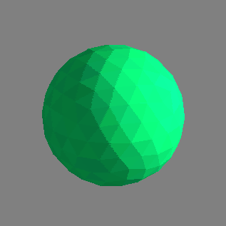
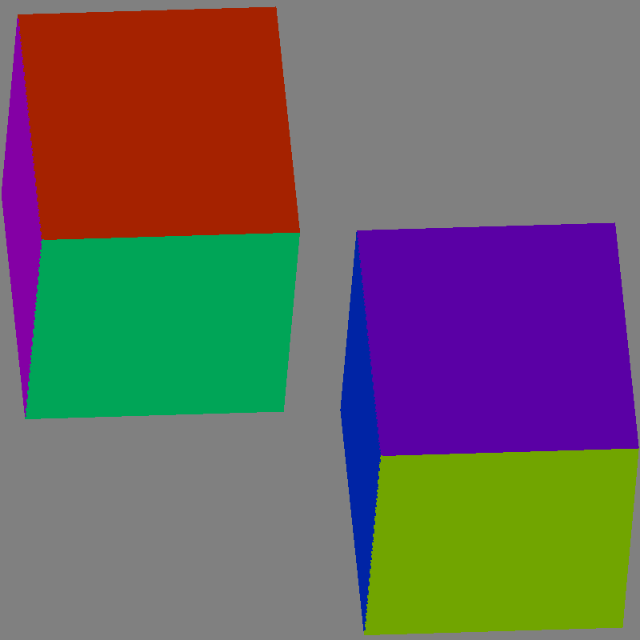
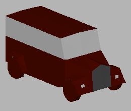
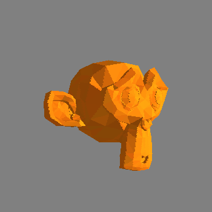
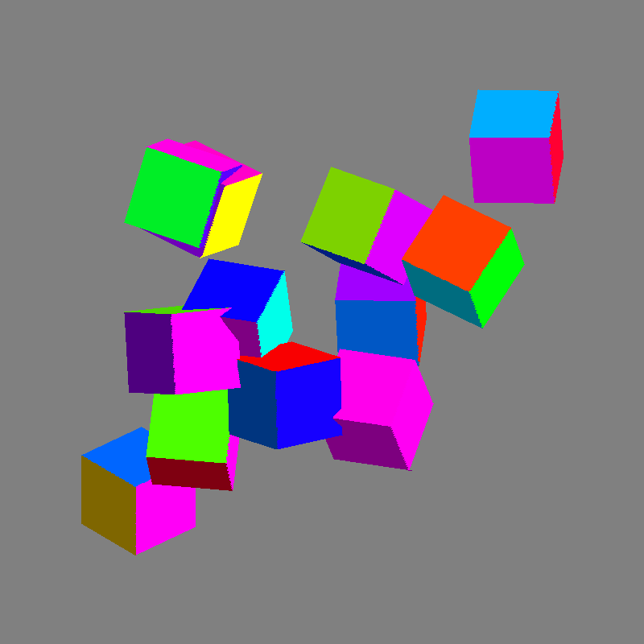
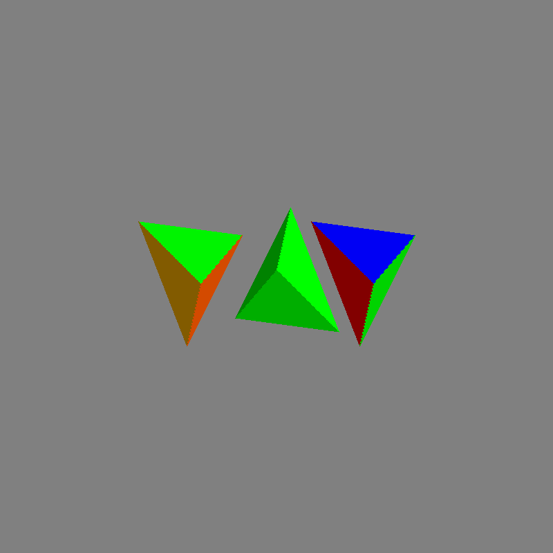

# The 3D Renderer

This assignment implements a simple but complete pipline for rendering 3D shapes 
represented by polygons.

This Program had to:
  -   Read the lightsource direction and all the polygon from a file.
  -   Rotate all the polygons so that the view direction is along the z-axis. Rotate the
  lightsource direction by the same amount
  -   Compute the bounding box of the collection of polygons then translate and scale 
  all the polygon so they fit within the image (ie. 0 <= x <= windowWidth)
  -   Mark all the polygons that are facing away from the viewer (ie. the Z component 
  of their normal vector is positive) as hidden
  -   Use a Z-buffer to render the image
  -   Initialise the Z-buffer (eg. gray backgrond, and an infinite depth at each point)
  -   For each non-hidden polygon:
      -   Compute the EdgeLists for the polygon, specifying the left and right values 
      for x and z for each line of the image
      -   Compute the z values of all the pixels on the polygon (by stepping through each
      row of the edgelist array, and interpolating from the left to the right values), 
      for each x and y, putting the z value (and color value of the light from the 
      polygon) in the Z-buffer if the depth is less than the depth of the current value 
      in the Z-buffer
  -   Turn the array of colors in the Z-buffer into an image and save it to a file 
  and/or display it in a window

Possible Polygons
  -   Ball 
  -   BigBoxes 
  -   Car 
  -   Monkey 
  -   Shapes 
  -   Tetras 
