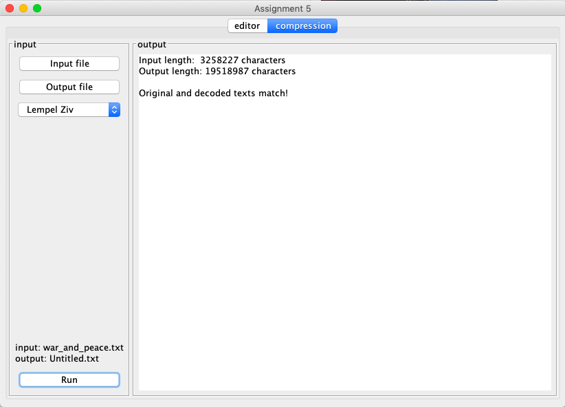

# Assignment 5

This assignment has 3 parts

## String Search

Implement the brute force and KMP string search algorithms to enable searching in
the text editor. It takes two arguements: the text to search through and the string
to search for. It then returns the starting index of the first match if one exists.

KMP
  -   Compute the match table for input string
  -   Perform the string search
  
Brute Force
  -   Perform string search

  
## Huffman Coding

Implement the Huffman coding and decoding algorithm. 

Huffman 
  -   Create a tree of binary codes for each character in the input text
  -   Encode input text using that tree
  -   Decode previously encoded text with that tree

  
## Lempel-Ziv Compression

Implement the Lempel-Ziv 77 compression and decompression algorithms.

Lempel-Ziv
  -   Compress text using | as a delimit (not included in given texts)
  -   Decode text

